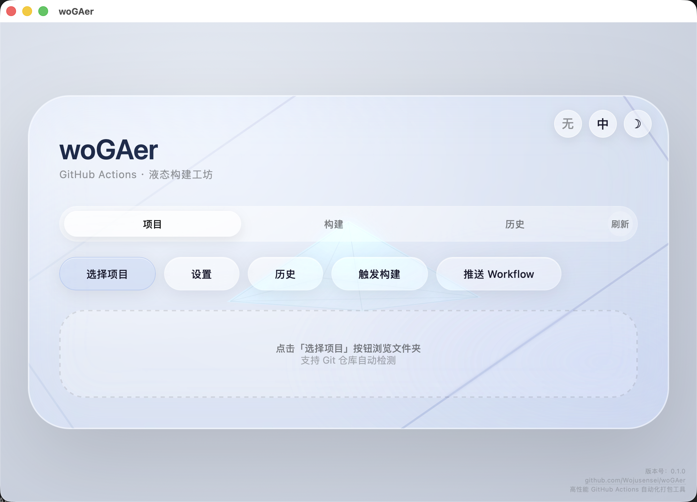

# 🚀 woGAer

这是一个新手向 GitHub Actions 自动化打包工具，用来降低 Github Actions 的使用难度。用户在下载本工具到本地之后，可以通过选择本地项目、分析技术栈、生成并推送 Workflow、触发远程构建来跟踪构建进度并下载多平台安装包，无特殊情况基本不用手写 YAML。




为保障高性能的后端以及舒适的前端，项目基于 Rust + Tauri v2 + Vite 构建，没有框架包袱。Git 操作统一走系统 git 命令，所有构建任务在后台**异步执行**。打包产物会在工具内部一一列举，可仅下载有需要的构建产物，避免浪费时间和空间。**依旧地**，采用液态玻璃 UI 界面。


## 🔧 功能

### 项目分析
- 通过文件夹对话框或拖拽选择本地项目，工具可以接收用户本地的文件
- 自动检测是否为 Git 仓库、当前分支、工作区是否干净等等
- 解析 `origin` 远程地址，得到 `repo_owner` 和 `repo_name`
- 根据项目文件识别技术栈：经测试，Rust、Node.js、Python、Go、Java、C++、Docker 等均可正常识别
- ！！！非 Git 项目仍可分析，但**不会触发 Workflow 生成与构建** ！！！

### Workflow 生成与推送
- 为普通项目生成对应语言的 GitHub Actions `build.yml`
- 检测到 `src-tauri` 目录时，自动生成 Tauri 多平台打包模板
- Tauri 模板覆盖大部分主流 Linux 发行版、MacOS、Windows，可以构建 deb、rpm、dmg、exe 等安装包
- 通过 GitHub Contents API 直接写入 `.github/workflows/build.yml`
- 不执行 `git add`、`git commit`、`git push`，不会污染代码历史和仓库
- 本项目的打包就是利用项目自身完成的 (bushi

### GitHub 登录
- 由于 Github Action 的使用要求，用户需在我们的工具内登录并匹配仓库才能正常使用
- 支持 Personal Access Token 登录，自动调用 `/user` 验证并展示头像与用户名
- 设置面板内置傻瓜式引导：生成 Token、勾选 workflow 权限、粘贴、保存
- 支持高级的设备码登录，适配需要 OAuth App Client ID 的场景
- 输入的 Token 会保存在本地，退出登录后同时清除前端和后端状态

### 触发构建与状态跟踪
- 一键即可触发 `workflow_dispatch`，如若失败会有反馈
- 返回 `run_id` 并写入本地历史记录
- 轮询 `get_build_status` ，您也可以直接在 Actions 查看进度与报错
- 不完整进度条展示排队中、进行中、已完成、失败等状态
- 构建页会显示 Run ID、触发时间、耗时、状态日志和进度条
- 构建结束后自动停止轮询，并展示产物列表，可选择需要的下载

### 产物下载
- 列出当前构建的所有 GitHub Actions artifact
- 每个产物独立显示文件名、大小和下载按钮
- 下载过程通过 Tauri 事件实时上报进度
- 已支持断点续传，下载完成后可在状态栏直接打开所在文件夹

### 历史记录
- 使用本地 SQLite 保存每次构建记录
- 历史页以表格展示仓库名、触发时间、状态、产物数量
- 支持展开查看某次构建的产物列表
- 提供打开 GitHub 对应 Run 页面的快捷操作

### 设置与偏好
- GitHub Token、语言偏好使用 localStorage 持久化
- 内置中英文切换
- 深色 / 浅色主题切换
- 语言和主题修改即时生效，不中断当前构建任务

### 液态玻璃 UI
- WebGL 光线追踪液态玻璃背景，支持折射、反射和动态光斑
- 真·玻璃面板、体温计一样的进度条(虽然不是全真进度)、左下角状态消息栏
- 状态消息分为成功、失败、进行中三类(均设计了不同的侧边颜色标识)，5 s 后自动消失
- 界面不使用 `alert()` 弹窗，所有错误在界面内展示
- 部分思路参考了 https://github.com/shuding/liquid-glass 仓库提供的液态玻璃构建方案

```text
git rev-parse --git-dir
git branch --show-current
git remote get-url origin
git status --porcelain
```

`parse_remote` 同时兼容 HTTPS、`git@` SSH 和 `ssh://` 三种远程地址格式，从而可以解析出 `owner/repo`。

### Workflow 模板生成
`WorkflowTemplate::generate` 根据检测到的语言返回不同模板。Tauri 项目走 `tauri_template`，其核心思路是：

- 按平台拆分 `build-ubuntu`、`build-windows`、`build-macos`、...
- 每个平台安装对应系统依赖
- 执行 `npm run tauri build`
- 使用 `find` 只收集真实安装包扩展名（`.deb`、`.rpm`、`.dmg`、`.msi`、`.exe` 等），可以避免把 deb 内部文件误当作产物
- 通过 `fromJson` 动态 matrix 把每个安装包单独上传为一个 artifact

### 推送，但不污染仓库

早期方案使用本地 `git push`，但会改动提交历史，这是令使用者感到膈应的。现在改为 GitHub Contents API：

```text
GET  /repos/{owner}/{repo}/contents/.github/workflows/build.yml
PUT  /repos/{owner}/{repo}/contents/.github/workflows/build.yml
```

这个方案可以读取远程文件 SHA，将本地生成的 `build.yml` base64 编码后提交，只修改这一个文件，不产生额外提交、不拉取、不合并远程分支，从而达到上述“不污染远程仓库”的效果。

### 登录与 Token 生命周期
存储的 Token 先在前端 localStorage 持久化，启动时通过 `set_github_token` 注入后端内存。Rust 侧用 `reqwest` 请求 `/user` 验证有效性；失败时自动清除并提示重新登录。设备码登录则是采用了标准 GitHub OAuth Device Flow：

```text
POST /login/device/code
POST /login/oauth/access_token
```

轮询期间按 GitHub 返回的 `interval` 等待，直到授权成功、拒绝或过期。

### 触发构建
触发构建之前先校验仓库访问权限，再调用：

```text
POST /repos/{owner}/{repo}/actions/workflows/{workflow_id}/dispatches
```

成功后会短暂等待并查询最新一次 run，从而拿到 `run_id`。错误信息会按状态码被翻译为可读提示：

- `404`：仓库不存在、无访问权限，或 workflow 未生成
- `403`：Token 权限不足，需要 `workflow` 权限
- `422`：分支或 inputs 参数无效
- `超时`：提示检查网络


### 状态轮询
在前端使用了 `setInterval` 定时调用 `get_build_status`，Rust 侧则在独立线程中请求 GitHub API，避免阻塞 Tauri 事件循环。构建进入 `completed` 或 `failed` 后立即停止轮询，并更新进度条为对应提示颜色，给予用户正确的反馈。

### 下载器
`Downloader` 使用 `Range` 请求实现了断点续传：先检查本地临时文件大小，再从中断位置继续下载。进度通过 Tauri event `download-progress` 推送到前端，界面据此更新进度条。

### 历史持久化
每次触发构建都会写入 SQLite `build_records` 表，包含 `run_id`、仓库名、workflow id、状态、触发时间、触发类型和平台。历史页从数据库读取，不依赖网络，这让用户可以在页面里查询到自己的构建历史，防止大量重复构建任务。

### 阻塞任务隔离
GitHub API 使用 `reqwest::blocking`，全部通过 `run_blocking` 放到独立线程执行，再用 `oneshot` 把结果传回 async 层。这样，长耗时请求不会卡住界面，也不会破坏 Tauri 的 tokio 运行时。


## 📖 目录结构

```text
woGAer/
├── index.html                  # 前端主界面与业务逻辑
├── src/
│   ├── main.js                 # Vite 入口
│   ├── styles.css              # 样式入口
│   └── assets/                 # 静态资源
├── src-tauri/
│   ├── tauri.conf.json         # Tauri 配置
│   ├── Cargo.toml
│   ├── icons/                  # 图标
│   └── src/
│       ├── main.rs             # Tauri 命令注册与业务编排
│       ├── actions/
│       │   └── workflow.rs     # GitHub API 客户端和 Workflow 模板
│       ├── git/
│       │   └── repo.rs         # Git 仓库分析
│       ├── db/
│       │   └── sqlite.rs       # 构建历史持久化
│       ├── downloader/
│       │   └── stream.rs       # 断点续传实现
│       └── i18n/
│           └── mod.rs          # 文本
└── .github/
    └── workflows/
        └── build.yml           # 本项目多平台打包 workflow
```


## 🚄 开发环境

```bash
# 前端依赖的安装
npm install

# 开发模式自动启动 Vite 和 Tauri 窗口
npm run tauri dev

# 仅构建前端的产物
npm run build
```


## 🚥 使用流程

1. 启动 woGAer 应用
2. 点击「选择项目」或拖拽项目文件夹到 dropZone
3. 等待自动分析完成
4. 点击「推送 Workflow」将生成的 `build.yml` 写入 GitHub
5. 点击「触发构建」启动 GitHub Actions
6. 在「构建」标签页查看进度、日志和产物
7. 在产物列表点击「下载」保存安装包
8. 在「历史」标签页查看历史构建记录

## 📦 下载与安装

所有安装包见：[woGAer v0.1.0 Releases](https://github.com/Wojusensei/woGAer/releases/tag/v0.1.0)

项目自带 GitHub Actions 多平台打包 workflow，每次推送到 `main` 或手动触发都会生成：（这里就以本项目举例）

- macOS：`wogaer_0.1.0_aarch64.dmg`
- Windows：`wogaer_0.1.0_x64-setup.exe`
- Debian / Ubuntu：`wogaer_0.1.0_amd64.deb`
- Fedora / RHEL：`wogaer-0.1.0-1.x86_64.rpm`
- Linux 通用：`wogaer-0.1.0-linux-x64.tar.gz`

### 安装示例：

#### 汇总

MacOS:[下载 wogaer_0.1.0_aarch64.dmg](https://github.com/Wojusensei/woGAer/releases/download/v0.1.0/wogaer_0.1.0_aarch64.dmg)

Windows:[下载 wogaer_0.1.0_x64-setup.exe](https://github.com/Wojusensei/woGAer/releases/download/v0.1.0/wogaer_0.1.0_x64-setup.exe)

Debian or Ubuntu:[下载 wogaer_0.1.0_amd64.deb](https://github.com/Wojusensei/woGAer/releases/download/v0.1.0/wogaer_0.1.0_amd64.deb)

Fedora or RHEL:[下载 wogaer-0.1.0-1.x86_64.rpm](https://github.com/Wojusensei/woGAer/releases/download/v0.1.0/wogaer-0.1.0-1.x86_64.rpm)

Linux 通用:[下载 wogaer-0.1.0-linux-x64.tar.gz](https://github.com/Wojusensei/woGAer/releases/download/v0.1.0/wogaer-0.1.0-linux-x64.tar.gz)

#### MacOS：

```bash
open wogaer_0.1.0_aarch64.dmg
```
当前 dmg 未签名、未公证。首次打开请右键点击 App 图标，选择「打开」；或执行：

```bash
xattr -dr com.apple.quarantine /Applications/wogaer.app
```

#### Windows：
```bash
wogaer_0.1.0_x64-setup.exe
```
当前 exe 未签名。首次运行如出现 SmartScreen 警告，点击「更多信息」->「仍要运行」。
#### Debian / Ubuntu
```bash
sudo dpkg -i wogaer_0.1.0_amd64.deb
```
#### Fedora / RHEL
```bash
sudo rpm -ivh wogaer-0.1.0-1.x86_64.rpm
```

#### Linux 通用
```bash
mkdir -p /opt/wogaer
tar -xzvf wogaer-0.1.0-linux-x64.tar.gz -C /opt/wogaer
/opt/wogaer/wogaer-0.1.0-linux-x64/wogaer
```

#### Linux 通用包依赖说明

`wogaer-0.1.0-linux-x64.tar.gz` 是便携版，里面只有 woGAer 可执行文件、desktop 文件和图标，**不包含任何系统运行库**。它依赖系统自带的 WebKitGTK / GTK 图形栈，所以不同发行版需要先安装对应的运行时依赖，否则启动时会报缺少共享库。

##### 最低要求

- x86_64 Linux 发行版
- glibc 版本 ≥ 2.35（安装包基于 Ubuntu 22.04 构建）
- 有图形界面环境（X11 或 Wayland），不支持无显示器的纯命令行服务器
- 建议系统已安装 WebKitGTK 4.1 和 GTK 3 运行时

推荐的发行版基线：

- Debian 12+
- Ubuntu 22.04+
- Fedora 37+
- Arch Linux 滚动版本
- openSUSE Tumbleweed / Leap 15.5+

如果发行版过老，例如 Ubuntu 20.04、Debian 11，运行时可能报：

```text
version `GLIBC_2.34' not found
```

这种问题无法靠安装额外依赖解决，需要使用更高版本的系统，或改用 `.deb` / `.rpm` 安装包。

###### 依赖清单

运行 woGAer 主要依赖以下运行时：

- `webkit2gtk-4.1`：Tauri 的 WebView 渲染引擎
- `gtk3`：窗口和界面基础库
- `librsvg2`：SVG 图标渲染
- `libappindicator`：系统托盘/指示器支持（可选）
- `libsoup3`：WebKit 网络层依赖，通常随 webkit2gtk 自动安装

#### 各发行版安装

##### Debian / Ubuntu

```bash
sudo apt update
sudo apt install -y libwebkit2gtk-4.1-0 libgtk-3-0 librsvg2-common
```

如果需要托盘支持：

```bash
sudo apt install -y libayatana-appindicator3-1
```

##### Fedora / RHEL / Rocky Linux

```bash
sudo dnf install -y webkit2gtk4.1 gtk3 librsvg2
```

如果需要托盘支持：

```bash
sudo dnf install -y libappindicator-gtk3
```

##### Arch Linux / Manjaro

```bash
sudo pacman -S --needed webkit2gtk-4.1 gtk3 librsvg
```

如果需要托盘支持：

```bash
sudo pacman -S --needed libappindicator-gtk3
```

##### openSUSE

```bash
sudo zypper install -y webkit2gtk3 gtk3 librsvg2
```

如果软件源中找不到 `webkit2gtk3`，请确认使用的是较新的 openSUSE 版本，或安装对应的 `webkit2gtk-4.1` 包。

#### 解压与运行

```bash
mkdir -p /opt/wogaer
tar -xzvf wogaer-0.1.0-linux-x64.tar.gz -C /opt/wogaer
/opt/wogaer/wogaer-0.1.0-linux-x64/wogaer
```

如果系统是桌面环境，也可以先安装 desktop 文件：

```bash
sudo cp /opt/wogaer/wogaer-0.1.0-linux-x64/share/applications/wogaer.desktop /usr/share/applications/
sudo cp -r /opt/wogaer/wogaer-0.1.0-linux-x64/share/icons/* /usr/share/icons/
```

##### 依赖检查

解压后可以用 `ldd` 检查是否缺少运行库：

```bash
ldd wogaer-0.1.0-linux-x64/wogaer | grep "not found"
```

如果没有输出，说明系统运行库齐全，可以直接启动。

##### 常见错误

###### 报错：`error while loading shared libraries: libwebkit2gtk-4.1.so.0`

缺少 WebKitGTK 运行时，执行对应发行版的安装命令。

###### 报错：`error while loading shared libraries: libgtk-3.so.0`

缺少 GTK3，执行对应发行版的安装命令。

###### 报错：`Gtk-ERROR **: cannot open display`

当前环境没有图形界面，或没有设置显示服务器。需要在有桌面会话的环境中运行：

```bash
export DISPLAY=:0
./wogaer
```

Wayland 会话通常不需要手动设置 `DISPLAY`。

###### 报错：`version GLIBC_2.34 not found`

系统太旧，glibc 低于构建基线。请使用更高版本的发行版，或改用官方 `.deb` / `.rpm` 安装包。

## 🦀 技术栈

- 桌面框架：使用 Tauri v2 构建
- 后端语言：Rust 传统艺能
- Rust 依赖：`reqwest`、`gix`、`rusqlite`、`tokio`、`serde`、`base64`
- 前端：Vite + 原生 HTML/CSS/JavaScript
- 前端依赖：`@tauri-apps/api`
- 持久化：SQLite + localStorage
- 持续集成：GitHub Actions


## 🤝 贡献

- 欢迎通过 Issue 和 Pull Request 参与 woGAer 的开发。无论是修复 bug、增加功能、完善文档还是优化 UI，都**非常欢迎！**
- 请确保代码符合项目风格，并在提交前运行 cargo clippy 和 npm run build 检查～

### 提交 Issue

提交前请先搜索已有 Issue，避免重复。Issue 请尽量包含以下信息：

- 问题描述：发生了什么，期望结果是什么，可以的话请提供详细日志甚至是录屏资料
- 复现步骤：从启动应用到复现问题的完整操作
- 环境信息：操作系统、woGAer 版本、Node/Rust 版本
- 日志信息：终端输出、错误文案、网络请求失败时的状态码
- 截图或录屏：能帮助定位 UI 和交互问题

如果问题涉及 GitHub 权限，例如触发构建、推送 Workflow、下载产物失败，请保留 GitHub API 返回的错误信息，但请**不要粘贴真实 Token ！！！**

### 提交 Pull Request

- Fork 仓库并在新分支上开发，分支命名建议使用 `feat/`、`fix/`、`docs/` 前缀，好区分
- 保持改动范围聚焦，一个 PR 解决一个问题最为合适，还能避免因为局部问题导致的 PR 被拒，提高 merge 概率(眨眼)
#### 修改 Rust 代码前请运行：

```bash
cargo fmt
cargo clippy -- -D warnings
cargo test
```

#### 修改前端代码前运行：

```bash
npm run build
```

- 涉及 Tauri 命令、数据库结构或 GitHub API 行为时，补充或更新对应测试
- PR 描述中说明动机、改动内容和测试方式
- 如果 PR 修复了某个 Issue，在描述中关联该 Issue

#### 代码风格

- Rust 代码遵循 `rustfmt` 和 `clippy`
- 前端保持原生 HTML/CSS/JS 风格，尽可能不引入新框架。如若真的有需要的引入，请详细和仓库维护者说明
- UI 文案尽量不使用 emoji，错误信息使用中文或英文，并与现有 i18n 文案保持一致
- **不要在代码中硬编码个人 Token、密钥或远程仓库的 url！！！**
- 新增用户可见文案时，同时补充 `i18n/mod.rs` 的中英文条目

### 安全说明

如果发现安全漏洞，尽量不要公开发布细节，可以优先通过 GitHub Security Advisory 或仓库维护者的私信提交。个人邮箱我已显示在主页。请万万不要在 Issue、PR 或评论中贴出 Token、Cookie 或任何密钥。


## 🤔 FAQ

### 1. ask:打开应用后窗口是空白页面？

通常是前端依赖未安装或 Tauri API 无法解析。请先执行：

```bash
npm install
```

确认 `package.json` 中存在 `@tauri-apps/api`，然后重新运行 `npm run tauri dev`。如果 Vite 提示无法解析 `@tauri-apps/api/core`，说明 `node_modules` 不完整，删除后重新安装：

```bash
rm -rf node_modules package-lock.json
npm install
```

### 2. ask:登录后头像没有更新？

保存 Token 后应用会自动关闭设置面板并在后台验证。头像更新依赖网络请求 `/user`，如果网络超时或 Token 失效，会回退到未登录状态并显示错误提示。可以在「设置」中重新保存 Token，或检查网络连接。

### 3. ask:提示 Token 无效或权限不足？

GitHub Token 需要勾选 `workflow` 权限，且对目标仓库有读取权限。常见原因如下：

- Token 过期或被吊销
- 创建 Token 时没有勾选 `workflow`
- 目标仓库为私有仓库，但 Token 没有 `repo` 权限
- 网络无法访问 `api.github.com`

建议重新生成 Token，按设置面板中的引导勾选权限后再试。

### 4. ask:触发构建报「仓库不存在或没有访问权限」？

woGAer 会先从本地 Git remote 解析 `owner/repo`，再调用 GitHub API 校验。请您务必在出现该提示时检查：

- 本地 `origin` 是否指向正确的仓库
- 当前登录账号是否能访问该仓库
- Token 是否有效
- 仓库是否真的存在

如果仓库是私有仓库，还需要确认 Token 有 `repo` 权限。

### 5. ask:触发构建报「workflow 文件不存在」？

这是由于 GitHub 只允许触发仓库中已存在的 workflow。请先在「项目」页点击「推送 Workflow」，确认 `.github/workflows/build.yml` 已写入远程仓库，然后再触发构建。

### 6. ask:推送 Workflow 失败？

推送使用 GitHub Contents API，需要 Token 具备 `contents:write` 权限。另外请确认：

- 仓库存在且当前账号可写
- 分支名正确
- 本地 `.github/workflows/build.yml` 已成功生成

woGAer 只会修改 `.github/workflows/build.yml`，不会提交代码，也不会推送代码历史。

### 7. ask:构建失败但进度条还在跑？

如上说明的，woGAer 会轮询 GitHub 获取最终状态。如果检测到 `completed` 或 `failed`，进度条会立即停止并变红。若长时间没有反应，通常是网络请求超时，可以点击「刷新」重新获取状态。

### 8. ask:构建产物只有几个，缺少 dmg/exe/deb？

产物数量由项目自身的 Tauri 配置决定。检查目标项目的 `src-tauri/tauri.conf.json`：

```json
"bundle": {
  "targets": ["msi", "nsis", "deb", "rpm", "dmg"]
}
```

`targets` 中没有声明的安装包是不会生成的。woGAer 生成的 Workflow 会收集 `bundle` 目录中的真实安装包文件，不再上传 deb 内部文件。

### 9. ask:macOS 构建在 npm ci 阶段失败？

维护者本人的 GitSync 这类项目曾经也在 macOS runner 上失败过，原因是 `package-lock.json` 中的镜像源或旧版依赖不兼容 Apple Silicon。这**不是本工具的问题**。建议：

- 删除 `package-lock.json` 中的国内镜像 `resolved` 地址，改用官方的 registry 源
- 删除无用且带 install script 的旧依赖
- 重新生成锁文件后提交

```bash
npm config set registry https://registry.npmjs.org
rm -rf node_modules package-lock.json
npm install
```

### 10. ask:下载产物时提示 401 ?

下载 GitHub Actions artifact 需要登录态。请确认 Token 有效，且对目标仓库有读取权限。如果 Token 已过期，重新登录后再下载。

### 11. ask:历史记录存储在哪里?

历史构建记录会保存在本机 SQLite 数据库中，位于 Tauri 应用数据目录下的 `wogaer.db`。删除该文件会清空本地历史，但是不会影响 GitHub 上的构建记录。

### 12. ask:语言和主题设置会保存吗?

会。语言和主题偏好保存在 localStorage 中，下次启动自动加载。切换语言或主题不会中断正在进行的构建轮询。

### 13. ask:设备码登录需要什么?

设备码登录需要 GitHub OAuth App 的 Client ID。在 GitHub「Settings -> Developer settings -> OAuth Apps」中创建一个应用即可，不需要上传 Secret。设备码登录适合不想直接使用 Personal Access Token 的场景。

### 14. ask:woGAer 会修改我的代码吗?

综上所述，不会。woGAer 只会在项目目录中创建 `.github/workflows/build.yml`，并通过 GitHub Contents API 写入远程仓库。它不会执行 `git add`、`git commit`、`git push`，也不会修改你的源码、分支或提交历史。

### 15. ask:我的构建失败了！

这种情况是会发生的，以下几种情况与 woGAer 本身无关：

#### 15.1 项目本身编译不过
- Rust 项目 cargo build 失败（语法错误、依赖冲突、缺少 target）
- Node 项目 npm ci 失败（package-lock.json 损坏、私有依赖没权限）
- Python 项目 pip install 失败（requirements.txt 里写了不存在的包）
- ...
- woGAer 会在检测到失败后在 UI 显示错误日志，告诉用户「构建失败，请检查项目代码」。

#### 15.2 缺少构建产物
- 用户 build.rs 或 build.sh 没生成正确的产物文件
- 产物路径写错了，GA 打包时找不到东西
- ...
- woGAer 会在生成 workflow 时自动匹配主流框架的默认产物路径（target/release/、dist/、build/），但用户如果改了路径，还是会失败

#### 15.3 测试用例失败
- 很多项目在 CI 流程里会先跑测试，测试不过就中断构建
- 此乃用户项目问题， woGAer 无能为力

#### 15.4 缺少系统依赖
- 项目依赖 OpenSSL、libssl-dev、cmake 等系统级库，但 GA 的 Ubuntu runner 上并没有没预装
- woGAer 会在生成的 workflow 模板里预设常见依赖的安装步骤（apt-get install），但**不能**覆盖所有情况。

#### 15.5 网络问题
- 依赖下载超时（crates.io、npm registry、PyPI 在某些地区被墙或慢）
- woGAer 不能解决此问题。Github Actions 的 runner 网络由 GitHub 控制。

#### 15.6. GitHub Token 权限不足
- 用户填入的 Token 没有 workflow 权限的勾选
- 需要打包的项目关联私有仓库，但 Token 没有 repo 权限
- woGAer 会在登录时验证 Token 是否有 workflow 权限，权限不足会给予用户提示
- 需自查是否为私有仓库


## 📃 开源协议

- **MIT License**

- 正式声明前请补充仓库根目录的 `LICENSE` 文件
